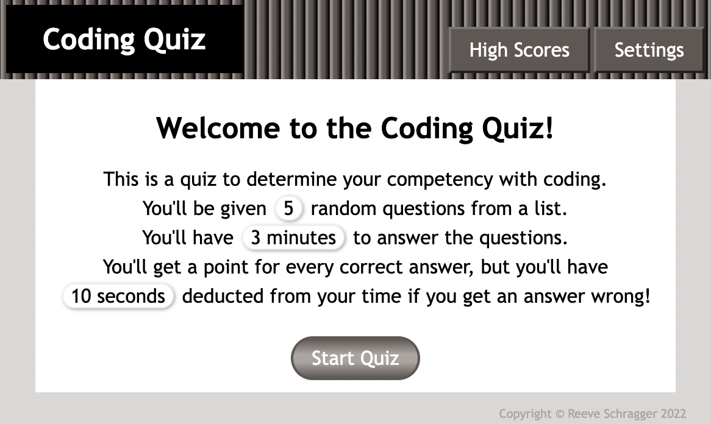

# BC04-02-Code-Quiz
Javascript Code Quiz

## Description

This is a timed coding quiz for fun and education. 
As you progress through the questions, at a time-scale you specify, time is deducted for any wrong answer making higher scores harder to achieve. <b>Try your luck and rate your skill! 🤞</b>

## Table of Contents

- [Installation](#installation)
- [Usage](#usage)
- [Credits](#credits)
- [License](#license)
- [Features](#features)

## Installation

Access to website at https://rschragger.github.io/BC04-02-Code-Quiz/ and Javascript running is all that is required.

Github page at https://github.com/rschragger/BC04-02-Code-Quiz

## Usage

### Initial view
 
The home screen has navigation buttons on top to settings and high scores. 
The Start Quiz button starts the questions. The process works within the bounds of the settings as laid out in this screen i.e. how many questions you'll be asked, how much time you'll have and what time penalty you'll receive for a wrong answer.

### Settings Screen
 
The settings screen has navigation buttons on top to home and high scores. 
There are text boxes for number of questions, time allowed and time deducted.
There are also checkboxes which allow you to choose which areas of interest you'd like to have questions from.
You must press the save settings button to save these settings to your device. This action will bring you back to the home screen.

### Question Screen
 
The question screen will appear once you start the quiz with the first randomly selected question. The question is asked at the top, and below are the four choices a to d displayed as buttons. Press the button you think references the correct answer.
If you get it right, the button will flash green and you'll proceed to the next question.
If you get it wrong, the button you pressed will turn red and the correct answer will show green. You will have the chosen time deducted from the timer before you proceed to the next question.

### Result Screen
 
The result screen has navigation buttons on top to home, settings and high scores.
This screen only appears after you have answered the last question, or you have run out of time on the quiz. 
The stats of your atttempt are listed.
If you wish to add your name to the high scores, type your name into the box and press the Submit button. This will direct you to the high score screen.

### High Scores Screen
 
The high score screen has navigation buttons on top to settings and home. 
This screen has a table with the top scores and who achieved them.
Note that we cap the quantity of displayed scores at 12 rows

## Credits

[Google](google.com) and many Javascript references in [w3schools](https://www.w3schools.com) and [MDN(Mozilla Dev Network)](https://developer.mozilla.org/en-US/) were used frequently to research topics and syntax used.

To convert my csv into JSON I used: 
http://www.convertcsv.com/csv-to-json.htm

Questions were sourced from the PDF: 
http://dimr.edu.in/wp-content/uploads/2020/10/BBACA_502-_Web-Technologies.pdf

Sounds sourced from https://freesound.org/.
Wrong answer - https://freesound.org/people/Jacco18/sounds/419023/#
Correct answer - https://freesound.org/people/LittleRainySeasons/sounds/335908/

## License

© Copyright Reeve Schragger 2022

## Features
- Different settings can be applied by the user such as
    - Time for quiz
    - Number of questions
    - Which units to draw questions from
- High Scores are recorded to local storage and are presented in descending order of scores
- There is a timer on the questions which actively counts down
    - it changes to yellow when there is 1 minute left
    - it changes to red when there is only 30 seconds left
- Sounds have been added for correct or wrong answers